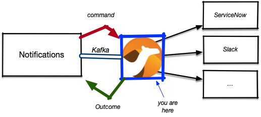

= Notifications-sender

This is a PoC for a Kafka - Camel 'bridge' for https://github.com/RedHatInsights/notifications-backend[Notifications backend] to enable
sending of Notifications via existing Camel components.

Basically we receive "commands" on the Kafka 'notifs' topic and send the outcome back via the Kafka 'notif-return' topic.

For ServiceNow support, I have generated a class 'Incident' by running:

[source, shell]
----
export SERVICENOW_INSTANCE=my-instance
export SERVICENOW_USERNAME=my-username
export SERVICENOW_PASSWORD=my-password
mvn -Pgen generate-sources
----

This is described in the https://github.com/apache/camel-quarkus/tree/main/integration-tests/servicenow[Camel Quarkus integration tests]
